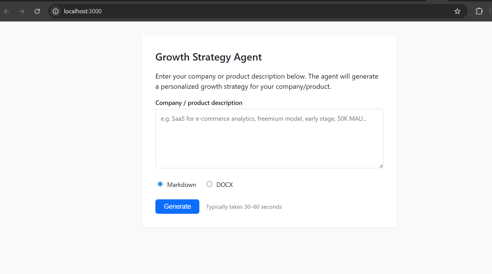

# Growth Strategy Agent

Generate **personalized, full-funnel growth strategies** for any company, product, or feature. Use free text or structured JSON as input; get Markdown or DOCX output. Works as a CLI, a Cursor skill, or a web UI.

---

## What you get

The agent produces a **detailed strategy document** (not generic advice). Every section is tailored to your company and product:

| Section | What it covers |
|--------|-----------------|
| **Executive summary** | Company context, growth thesis, top 3 priorities, constraints |
| **Retention** | Use case, retention metric, cohort implications |
| **Engagement & habit loops** | Organic and manufactured loops, activation, resurrection |
| **Acquisition** | Loops (viral, content, paid, sales), channel tactics, referral mechanics |
| **Monetization** | Four fits, pricing, friction tradeoffs |
| **Growth model** | Qualitative model (output, loops, linear drivers) |
| **User psychology** | ELMR/psychology applied to 1–2 key flows |
| **Experiments** | 3+ MVTs with hypothesis, metrics, ICE prioritization table |
| **Defensibility** | Which forms apply and how to strengthen |
| **Metrics to track** | Recommended metrics and dashboard views |
| **Prioritized action plan** | 5–10 actions with owners and order |
| **First 6 weeks** (optional) | Week-by-week execution focus |

---

## Quick start

**Prerequisites:** Node.js 18+, and one of: `OPENAI_API_KEY` or `ANTHROPIC_API_KEY`.

```bash
git clone <this-repo>
cd growth-strategy-agent
npm install
```

Create a `.env` file in the project root (copy from `.env.example` if present, or create one):

```bash
# Add exactly one of these:
OPENAI_API_KEY=sk-...
# or
ANTHROPIC_API_KEY=sk-ant-...
```

**Generate your first strategy** (free-text description):

```bash
node generate.js "SaaS tool for small e-commerce stores, freemium, early stage"
```

Output is written to `growth-strategy.md`. To save to a specific file or get DOCX:

```bash
node generate.js "Your description" -o my-strategy.md
node generate.js "Your description" -f docx -o my-strategy.docx
```

---

## Ways to run the agent

### 1. CLI with free text

Describe your company or product in one string. Best for a quick first pass.

```bash
node generate.js "B2B analytics dashboard for e-commerce, $99/mo, 500 customers, focus on activation"
```

### 2. CLI with structured JSON (recommended for best results)

Give the agent clear context: name, product, features, market, metrics, stage, and constraints. More structure → more specific, actionable output.

**Step 1:** Copy the example and edit it for your company:

```bash
cp company.example.json company.json
# Edit company.json with your details
```

**Step 2:** Run with your JSON file:

```bash
node generate.js --input company.json
```

**Step 3:** Optionally set output path and format:

```bash
node generate.js --input company.json -o strategy.md
node generate.js --input company.json -o strategy.docx
# or explicitly set format:
node generate.js -i company.json -f docx -o strategy.docx
```

**JSON fields** (all optional; more detail = better strategy):

| Field | Description |
|-------|-------------|
| `name` | Company or product name |
| `product` | What the product does, one short paragraph |
| `features` | Array of `{ "name", "purpose", "differentiator" }` |
| `targetMarket` | Who you sell to (persona, size, geography) |
| `competitors` | Array of competitor names + short differentiator |
| `currentMetrics` | e.g. `{ "users", "retention", "revenue" }` |
| `monetization` | Model and pricing (e.g. freemium, tiers) |
| `stage` | e.g. `early`, `growth`, `scale` |
| `currentChannels` | What you use today (SEO, paid, partnerships, etc.) |
| `uniqueConstraints` | Budget, team size, regulation, product-led only, etc. |
| `notes` | Extra focus areas or context |

See [company.example.json](company.example.json) for a full example.

### 3. Web UI

Run the local server and use the browser form:

```bash
npm run serve
```

Open http://localhost:3000. Paste company info (free text or JSON) and choose Markdown or DOCX. Requires `OPENAI_API_KEY` or `ANTHROPIC_API_KEY` in `.env`.


*Web UI at localhost:3000 — paste company info and generate Markdown or DOCX.*

### 4. Cursor skill (in-chat)

If you use [Cursor](https://cursor.com), the repo includes a skill so you can ask in chat:

- *"Create a growth strategy for [company/product]"*
- *"Build a growth plan for [X]"*

The agent uses the same framework and can export DOCX when you ask. Skill path: `.cursor/skills/growth-strategy/`.

---

## Output options

| Option | Description |
|--------|-------------|
| **Markdown (default)** | Written to `growth-strategy.md` or the path you pass with `-o`. Easy to version and edit in any editor. |
| **DOCX** | Use `-f docx` or an output path ending in `.docx` (e.g. `-o plan.docx`). Open in Word or Google Docs. |

Examples:

```bash
node generate.js --input company.json -o strategy.md
node generate.js --input company.json -o strategy.docx
node generate.js "description" -f docx -o strategy.docx
```

---

## No API key?

If you don’t set `OPENAI_API_KEY` or `ANTHROPIC_API_KEY`, the CLI **does not call an LLM**. Instead it writes a single file containing the full prompt (system + user) so you can paste it into Cursor or any LLM and run it yourself.

```bash
node generate.js --input company.json
# No API key → writes growth-strategy-prompt.md (or -o path)
# Then paste the contents into Cursor/Claude/ChatGPT
```

---

## CLI reference

```text
node generate.js [options] ["free text description"]

Options:
  -i, --input <file>   Path to JSON file (company/product info).
  -o, --output <file>  Output path. Default: growth-strategy.md (or .docx if -f docx).
  -f, --format <md|docx>  Output format. Can be inferred from -o extension.
```

**Examples:**

```bash
node generate.js "One-line product description"
node generate.js -i company.json
node generate.js -i company.json -o docs/strategy.md
node generate.js -i company.json -o strategy.docx
node generate.js "Description" -f docx -o strategy.docx
```

---

## Tech and API support

- **Node:** 18+
- **APIs:** OpenAI (GPT-4o) or Anthropic (Claude). Set one of `OPENAI_API_KEY` or `ANTHROPIC_API_KEY` in `.env`.
- **Optional:** `.env.example` in the repo lists the expected env vars; copy it to `.env` and add your key.

---

## License

See [LICENSE](LICENSE) in the repo.
